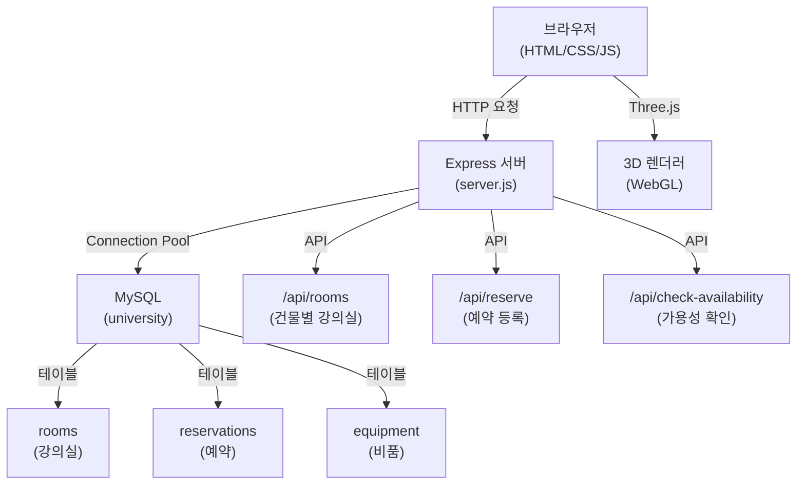

# JEIU Campus Explorer 3D

재능대학교 캠퍼스를 3D로 탐색하고 강의실을 예약할 수 있는 웹 애플리케이션

## 🎯 문제 정의 / 목표

**문제**: 캠퍼스 건물 정보와 강의실 예약을 별도 시스템에서 관리하여 사용자 경험이 분산됨

**목표**: Three.js 기반 3D 인터랙티브 맵과 강의실 예약 시스템을 통합하여 직관적인 캠퍼스 탐색 및 예약 경험 제공

## ✨ 주요 기능

1. **3D 캠퍼스 맵**: Three.js 기반 인터랙티브 3D 시각화, 건물 호버/클릭 탐색
2. **건물 정보 팝업**: 건물 설명, 이미지, 진행 중인 이벤트 정보 표시
3. **강의실 예약 시스템**: 건물별 강의실 조회, 실시간 예약 가능 여부 확인, 예약 등록
4. **예약 충돌 방지**: 동일 시간대 중복 예약 자동 차단
5. **이벤트 관리**: 건물별 이벤트 정보 및 전체 이벤트 목록 표시
6. **3D 뷰 조작**: OrbitControls를 활용한 카메라 회전 및 줌 기능

## 🛠️ 기술 스택

### Frontend
- HTML5/CSS3
- JavaScript (ES6+)
- Three.js (v0.132.2) - 3D 그래픽스 렌더링

### Backend
- Node.js
- Express.js (v5.1.0) - RESTful API 서버
- mysql2 (v3.14.0) - MySQL 연결 풀 관리

### DB
- MySQL/MariaDB (v8.0+)

### Infra/Deploy
- dotenv - 환경변수 관리

### 외부 API/연동
- 없음 (독립 실행)

### 인증/보안
- 입력값 검증 (날짜/시간/이름/학번)
- Prepared Statement를 통한 SQL 인젝션 방지

## 🏗️ 시스템 구성도



## 🚀 빠른 시작

### 요구사항
- Node.js (v14 이상)
- MySQL/MariaDB (v8.0 이상)
- npm

### 로컬 실행

1. **저장소 클론**
```bash
git clone <repository-url>
cd "JEIU Campus Explorer 3D"
```

2. **의존성 설치**
```bash
npm install
```

3. **환경변수 설정**
프로젝트 루트에 `.env` 파일 생성:
```env
DB_HOST=localhost
DB_USER=your_username
DB_PASS=your_password
DB_NAME=university
DB_PORT=3306
```

4. **데이터베이스 초기화**
```bash
mysql -u your_username -p university < university.sql
```

5. **서버 실행**
```bash
npm start
```

6. **접속**
브라우저에서 `http://localhost:3000` 접속

### 테스트
```bash
# 서버 상태 확인
curl http://localhost:3000/api/test
```

## 📋 환경변수 (.env.example)

| 변수명 | 설명 | 예시 형식 |
|--------|------|-----------|
| `DB_HOST` | MySQL 호스트 주소 | `localhost` |
| `DB_USER` | MySQL 사용자명 | `root` |
| `DB_PASS` | MySQL 비밀번호 | `your_password` |
| `DB_NAME` | 데이터베이스 이름 | `university` |
| `DB_PORT` | MySQL 포트 | `3306` |

## 📁 폴더 구조

```
JEIU Campus Explorer 3D/
├── server.js              # Express 서버 및 API 엔드포인트
├── db.js                  # MySQL 연결 풀 설정
├── package.json           # 프로젝트 의존성
├── university.sql         # 데이터베이스 스키마 및 시드 데이터
├── .env                   # 환경변수 (gitignore 대상)
└── public/
    ├── index.html         # 메인 페이지 (3D 캠퍼스 맵)
    ├── main.js            # Three.js 3D 맵 로직
    ├── styles.css         # 메인 페이지 스타일
    ├── classroom-info.html # 강의실 정보 및 예약 페이지
    ├── classroom-script.js # 강의실 페이지 스크립트
    ├── classroom-styles.css # 강의실 페이지 스타일
    └── img/               # 이미지 리소스
```

## 🔧 트러블슈팅 / 핵심 의사결정

### 1. 예약 시간 겹침 검증 로직
**이슈**: 동일 강의실의 시간대 겹침을 정확히 검증해야 함

**해결**: SQL 쿼리에서 3가지 겹침 케이스를 모두 체크
```sql
(start_time <= ? AND end_time > ?) OR  -- 시작점이 겹침
(start_time < ? AND end_time >= ?) OR  -- 종료점이 겹침
(start_time >= ? AND end_time <= ?)    -- 완전히 포함됨
```

### 2. Three.js OrbitControls CDN 로딩 실패 대응
**이슈**: CDN 로딩 실패 시 3D 맵이 동작하지 않음

**해결**: WebGL 지원 여부 및 Three.js 로드 상태를 체크하고, 실패 시 사용자 친화적 에러 메시지 표시

### 3. 데이터베이스 연결 풀 관리
**이슈**: 연결 끊김 시 서버가 중단되는 문제

**해결**: mysql2의 Connection Pool 사용, `keepAlive` 옵션 및 에러 핸들러로 자동 재연결 처리

## 📡 API 엔드포인트

| Method | Endpoint | 설명 |
|--------|----------|------|
| `GET` | `/api/test` | 서버 상태 확인 |
| `GET` | `/api/rooms?building={건물명}` | 건물별 강의실 목록 조회 |
| `GET` | `/api/rooms-with-equipment` | 예약 정보와 강의실 정보 조회 |
| `GET` | `/api/check-availability?room_id={id}&date={date}&start_time={time}&end_time={time}` | 예약 가능 여부 확인 |
| `POST` | `/api/reserve` | 강의실 예약 등록 |
| `DELETE` | `/api/reserve/latest` | 최근 예약 삭제 |

### 예약 등록 요청 예시
```json
{
  "room_id": 1,
  "user_name": "홍길동",
  "date": "2025-01-15",
  "start_time": "09:00:00",
  "end_time": "10:00:00",
  "university_number": "20240001"
}
```

## 🗄️ 데이터베이스 스키마

### rooms
- `id` (PK): 강의실 ID
- `building_name`: 건물 이름
- `room_number`: 강의실 번호
- `seat_count`: 수용 인원

### reservations
- `id` (PK): 예약 ID
- `room_id` (FK): 강의실 ID
- `user_name`: 예약자 이름
- `university_number`: 학번
- `date`: 예약 날짜
- `start_time`: 시작 시간
- `end_time`: 종료 시간

### equipment
- `id` (PK): 비품 ID
- `room_id` (FK): 강의실 ID
- `name`: 비품명
- `quantity`: 수량

## 📝 라이선스

ISC

---

## 💼 면접 질문 5개 + 답변 초안

### 1. Three.js를 선택한 이유와 렌더링 최적화 방법은?
**답변**: 웹에서 네이티브 3D 경험을 제공하기 위해 Three.js 선택. WebGL 기반으로 하드웨어 가속 활용. 건물 객체는 재사용 가능한 Geometry로 생성하여 메모리 효율화. OrbitControls로 카메라 조작을 구현하여 사용자 경험 개선.

### 2. 예약 시스템의 동시성 문제를 어떻게 해결했나?
**답변**: 데이터베이스 레벨에서 트랜잭션과 겹침 검증 쿼리를 사용. `SELECT FOR UPDATE`는 사용하지 않았지만, 예약 등록 전에 `SELECT`로 겹침을 확인하고, `INSERT` 시점에 다시 검증하여 Race Condition을 최소화. 실제 운영 환경에서는 트랜잭션 격리 수준을 조정하거나 Redis 기반 분산 락을 고려할 수 있음.

### 3. 입력값 검증 전략은?
**답변**: 클라이언트와 서버 양쪽에서 검증. 서버에서는 날짜 형식(YYYY-MM-DD), 시간 형식(HH:MM:SS), 시간 범위 유효성, 이름 길이(2-50자), 학번 길이(최대 20자)를 검증. SQL 인젝션 방지를 위해 Prepared Statement 사용. 에러 메시지는 사용자 친화적으로 제공.

### 4. 데이터베이스 연결 관리 방식은?
**답변**: mysql2의 Connection Pool 사용. `connectionLimit: 10`, `keepAlive: true` 설정으로 연결 재사용 및 자동 재연결 처리. `pool.on('error')` 핸들러로 연결 끊김 시 로깅 및 재시도. 서버 시작 시 `pool.getConnection()`으로 연결 테스트.

### 5. 프로젝트에서 가장 어려웠던 부분과 개선 계획은?
**답변**: Three.js의 Raycasting을 활용한 건물 클릭 감지 구현이 어려웠음. 초기에는 정확도 문제가 있었으나, 마우스 좌표 정규화와 카메라 업데이트 타이밍 조정으로 해결. 개선 계획: 1) 예약 알림 기능 추가, 2) 관리자 대시보드 구현, 3) Docker 컨테이너화로 배포 자동화, 4) 단위 테스트 및 E2E 테스트 추가.
